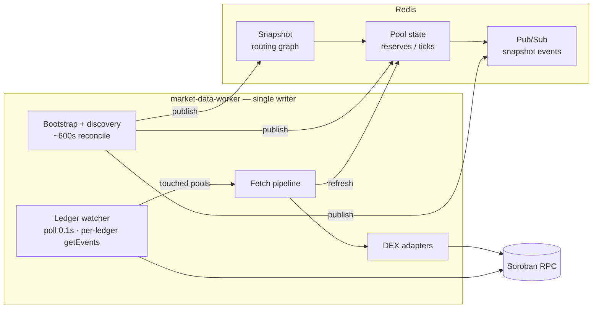
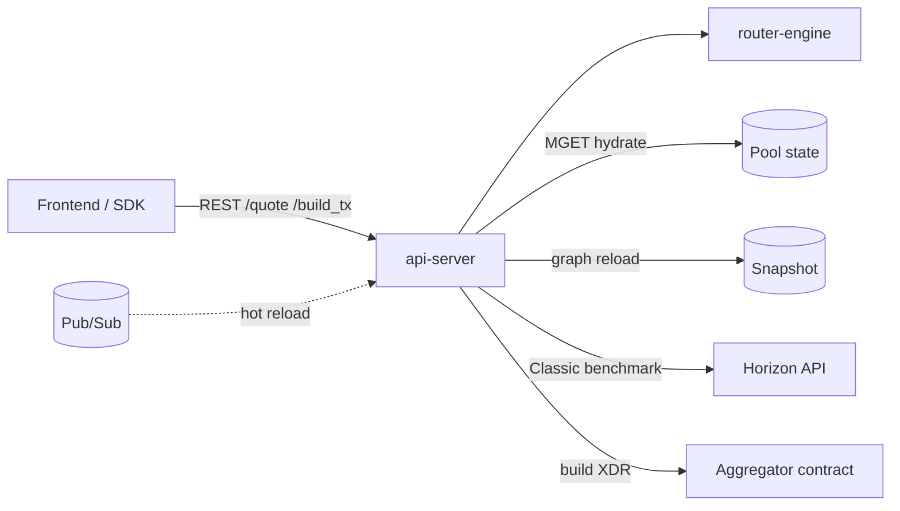
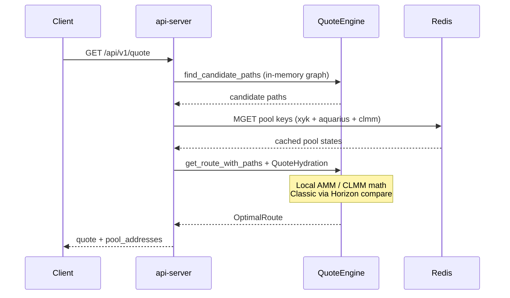

# Stellar DEX Aggregator (LumAgg)

[](https://github.com/Lum-Agg/stellar-dex-agg)
[](LICENSE)

Multi-source liquidity aggregation for Stellar's Soroban DEX ecosystem.

**Repository:** https://github.com/Lum-Agg/stellar-dex-agg

LumAgg routes swaps across **Soroswap**, **Aquarius** (xy=k, stable, CLMM), **Phoenix**, **Sushi V3**, and **Comet**, with optional comparison against **Classic DEX** (Horizon PathPayment). It supports multi-hop paths, split orders across venues, and atomic on-chain execution via an optional aggregator contract.

## Contents

- [Architecture](#architecture)
- [DEX sources](#dex-sources)
- [Key features](#key-features)
- [Why not Classic DEX routing?](#why-not-classic-dex-routing)
- [Project structure](#project-structure)
- [Development](#development)
- [Deployment](#deployment)
- [Configuration](#configuration)
- [Split routing](#split-routing)
- [Related docs](#related-docs)
- [License](#license)

## Architecture

### Design principles

| Principle | Implementation |
|-----------|----------------|
| **Topology vs state** | Routing graph (pairs, pool IDs, fees) is separate from live reserves / ticks |
| **Single writer** | `market-data-worker` owns all Redis writes; `api-server` is stateless |
| **Event-driven freshness** | Ledger events refresh *touched* pools; no periodic full-market sweep |
| **Cold pools stay valid** | Pools with no on-chain activity keep their last Redis value until overwritten |

Pool state updates use three channels: **bootstrap** (worker start), **ledger watcher** (hot path, poll 0.1s), and **discovery** (~600s reconciliation). See [`docs/pool-state-architecture.md`](docs/pool-state-architecture.md) for details.

### System overview

Two paths share one Redis store.

**1 — Pool state writes (`market-data-worker`)**



**2 — Quote reads (`api-server`)**



**Redis keys** (pool keys use `EX=86400`):

| Key pattern | Contents |
|-------------|----------|
| `lumagg:snapshot:*` | Versioned graph + CLMM metadata (no reserves) |
| `lumagg:pool:xyk:{source}:{pool}` | xy=k reserves |
| `lumagg:pool:aquarius:{pool}` | Aquarius N-token / stable reserves |
| `lumagg:pool:clmm:{source}:{pool}` | CLMM slot0, liquidity, ticks |
| `lumagg:snapshot:events` | Pub/Sub channel for snapshot hot-reload |

### Data layers

| Layer | Contents | Storage | Update cadence |
|-------|----------|---------|----------------|
| **Graph** | Token pairs, pool addresses, fee tiers; CLMM refs (no ticks) | `lumagg:snapshot:*` | Bootstrap; discovery ~600s |
| **Pool state** | xy=k reserves; Aquarius multi-token; CLMM slot0 + ticks + coverage | `lumagg:pool:*` | Ledger poll 0.1s for touched pools; bootstrap + discovery full publish |

The API does **not** keep a long-lived in-process pool cache. Each `/quote` reloads the graph from the last snapshot, then overlays pool state from Redis (`QUOTE_RPC_HYDRATE_ENABLED=false` by default).

### Quote request flow



Steps in code:

1. **Path discovery** — graph only; all candidate paths (no liquidity prune).
2. **Collect pool keys** — unique `(source, pool_address)` across paths.
3. **Redis MGET** — xy=k, Aquarius, CLMM state (written by worker).
4. **Quote** — local math; no RPC unless `QUOTE_RPC_HYDRATE_ENABLED=true`.
5. **Comet** — per-request hydrate (not stored in Redis).
6. **CLMM guard** — skip hops when tick coverage is incomplete.

### Ledger watcher (hot path)

Stellar Soroban RPC has no WebSocket / Geyser push — the worker **polls** `getLatestLedger` every **0.1s**, then fetches **one ledger at a time**:

```text
getLatestLedger
  → for each new ledger N:
      getEvents(N, N+1)
      → match contractId to KnownPoolIndex (pool + router event parse)
      → fetch pipeline: RPC refresh touched pools only
      → Redis SET (CLMM only if coverage.is_complete)
```

Active pools typically refresh within **~0.1–2s** after a swap / add / remove on-chain.

**CLMM policy:** tick data lives in pool contract storage. Worker writes Redis only when `coverage.is_complete`; otherwise quote engine skips those hops.

## DEX sources

| Source | Pool type | In routing graph | Pool state in Redis | Quote math |
|--------|-----------|------------------|---------------------|------------|
| **soroswap** | xy=k | Yes | Discovery + ledger | Constant product |
| **aquarius** | xy=k + stable | Yes | Discovery + ledger | xy=k / stable |
| **phoenix** | xy=k | Yes | Discovery + ledger | Fee-on-output |
| **sushi** | CLMM V3 | Yes | Discovery + ledger | Local `clmm_math` |
| **aquarius_clmm** | CLMM | Yes | Discovery + ledger | Local `clmm_math` |
| **comet** | Weighted | Yes | Discovery + ledger | Balancer math (quote-time) |
| **classic_dex** | Native orderbook | **No** | **Per quote** (Horizon) | Benchmark only |

## Key features

- **Multi-source aggregation** across six Soroban DEX families
- **Multi-hop routing** — BFS through intermediate tokens (configurable max hops)
- **Split orders** — Brent optimizer across paths when impact or competitiveness warrants it
- **Event-driven pool state** — ledger watcher + discovery; no periodic full sweep
- **Horizontally scalable API** — stateless `api-server` instances behind a load balancer
- **Sub-2s hot pool freshness** — 0.1s ledger poll + fetch pipeline for touched pools
- **Atomic on-chain execution** — optional aggregator contract (`split_swap`, `round_trip_swap`)
- **Classic benchmark** — Horizon PathPayment per quote without polluting the Soroban graph

## Why not Classic DEX routing?

Stellar's native PathPayment has **uncontrollable routing** — Stellar Core decides how to split across orderbooks and pools. You cannot force a specific pool or path.

This aggregator targets **Soroban DEXes** where each hop is a deterministic contract call. Classic DEX is a **per-quote benchmark** (and fallback for tokens only on the native DEX), not an edge in the pathfinder graph.

## Project structure

```
├── contracts/aggregator/       # Soroban contract (split_swap, round_trip_swap)
├── crates/
│   ├── market-snapshot/        # MarketSnapshot schema, Redis pool_state_store
│   ├── market-data-worker/     # Discovery, ledger watcher, fetch pipeline
│   ├── dex-adapters/           # Per-DEX adapters, RPC, pool index, router events
│   ├── router-engine/          # PathFinder, QuoteEngine, split optimizer
│   ├── api-server/             # REST API (/quote, /build_tx, /tokens)
│   ├── arbitrage/              # Round-trip arb scanner (aggregator.round_trip_swap)
│   ├── lumagg-alerts/          # Telegram / monitoring alerts
│   └── sdk/                    # Client SDK
├── docs/
│   └── pool-state-architecture.md
├── deploy/                     # systemd units (lumagg-api@, lumagg-worker)
├── deploy_server.sh            # rsync + build + restart on remote host
└── frontend/                   # SvelteKit demo UI
```

## Development

```bash
# Compile
cargo check --workspace --exclude aggregator-contract

# Tests
cargo test --workspace --exclude aggregator-contract

# Local file-backed stack (dev)
SNAPSHOT_DIR=data/snapshots cargo run -p market-data-worker
SNAPSHOT_DIR=data/snapshots cargo run -p api-server

# Local Redis-backed stack (production-style)
redis-server --port 6380 --save "" --appendonly no

SNAPSHOT_BACKEND=redis \
SNAPSHOT_REDIS_URL=redis://127.0.0.1:6380/ \
SNAPSHOT_REDIS_CHANNEL=lumagg:snapshot:events \
cargo run -p market-data-worker

LISTEN_ADDR=127.0.0.1:3113 \
SNAPSHOT_BACKEND=redis \
SNAPSHOT_REDIS_URL=redis://127.0.0.1:6380/ \
SNAPSHOT_REDIS_CHANNEL=lumagg:snapshot:events \
cargo run -p api-server
```

**Utility binaries** (`dex-adapters`):

```bash
# Audit ledger events → touched pools (live chain)
RPC_URL=... REDIS_URL=... AUDIT_LEDGERS=30 \
  cargo run -p dex-adapters --release --bin audit-ledger-events

# Dump per-ledger events to JSONL
DUMP_DIR=./ledger-events-dump DUMP_LEDGERS=5 \
  cargo run -p dex-adapters --release --bin dump-ledger-events
```

## Deployment

```bash
./deploy_server.sh          # api-server (4 instances) + worker
./deploy_server.sh api      # api-server only
./deploy_server.sh worker   # market-data-worker only
```

Systemd units live in `deploy/`:

| Unit | Role |
|------|------|
| `lumagg-worker.service` | Single writer — discovery, ledger watcher, Redis publish |
| `lumagg-api@.service` | Stateless API instances (ports 3100–3103) |

Worker defaults include `LEDGER_POLL_SECS=0.1`, `FETCH_PIPELINE_ENABLED=true`, `DISCOVERY_INTERVAL_SECS=600`.

## Configuration

### Shared

| Variable | Default | Meaning |
|----------|---------|---------|
| `RPC_URL` | mainnet gateway.fm | Soroban JSON-RPC endpoint |

### Snapshot & Redis

| Variable | Default | Component | Meaning |
|----------|---------|-----------|---------|
| `SNAPSHOT_BACKEND` | — | worker, API | `file` or `redis` |
| `SNAPSHOT_REDIS_URL` | — | worker, API | Redis URL (snapshots + pool state) |
| `SNAPSHOT_REDIS_CHANNEL` | `lumagg:snapshot:events` | worker, API | Pub/Sub for snapshot hot-reload |
| `SNAPSHOT_POLL_INTERVAL_MS` | `1000` | API | Polling fallback if Pub/Sub missed |
| `POOL_STATE_TTL_SECS` | `86400` | worker | Redis EX on pool keys (eviction, not freshness SLA) |

### Worker — discovery & ledger

| Variable | Default | Meaning |
|----------|---------|---------|
| `DISCOVERY_INTERVAL_SECS` | `600` | Full graph rediscovery + Redis pool publish |
| `REFRESH_INTERVAL_SECS` | `5` | Adapter cache refresh (feeds discovery) |
| `LEDGER_WATCHER_ENABLED` | `true` | Requires Redis pool store |
| `LEDGER_POLL_SECS` | `0.1` | Ledger poll interval (min `0.1`) |
| `LEDGER_MAX_CATCHUP` | `32` | Max ledgers ingested per poll after backlog |
| `FETCH_PIPELINE_ENABLED` | `true` | Ledger touched → task queue → Redis |
| `FETCH_WORKER_COUNT` | `8` | Concurrent RPC workers in fetch pipeline |
| `POOL_STATE_REFRESH_CONCURRENCY` | `8` | Concurrent getLedgerEntries batches |

### API — quoting & routing

| Variable | Default | Meaning |
|----------|---------|---------|
| `QUOTE_RPC_HYDRATE_ENABLED` | `false` | RPC fallback on Redis miss (emergency) |
| `QUOTE_HYDRATE_MAX_POOLS` | `12` | Max xy=k RPC hydrates when enabled |
| `PATH_FINDER_MAX_HOPS` | `3` | Max hops per path |
| `PATH_FINDER_MAX_MULTI_HOP_PATHS` | `50` | Cap on 2+ hop paths per quote |
| `PATH_FINDER_MAX_DIRECT_PATHS` | `0` | Cap on 1-hop pools (`0` = all) |
| `MAX_SPLITS` | `5` | Max candidate paths for split optimization |
| `SPLIT_THRESHOLD_BPS` | `5` | Min price impact (bps) before split attempt |
| `SPLIT_COMPETITIVE_DELTA_BPS` | `50` | Also split when 2nd path is within this bps of best |
| `MIN_SPLIT_FRACTION_BPS` | `5` | Drop split legs below this output share |

### DEX discovery overrides

| Variable | Default | Meaning |
|----------|---------|---------|
| `SUSHI_DISCOVERY_RPC` | public gateway | RPC for Sushi pool probes |
| `COMET_FACTORY` | Blend mainnet factory | Comet factory contract |
| `COMET_EXTRA_POOLS` | — | Comma-separated extra Comet pool IDs |

## Split routing

Production `deploy/lumagg-api@.service` sets split env vars explicitly.

- **`SPLIT_THRESHOLD_BPS=5` (0.05%)** — split runs when estimated impact ≥ 5 bps, or paths are competitive (within `SPLIT_COMPETITIVE_DELTA_BPS` with impact > 0).
- **`SPLIT_THRESHOLD_BPS=1` (0.01%)** — usually not worth it: more optimizer work, many quotes still return `split_rejected_reason: "no_improvement"`.
- Use `?debug=1` on `/quote` to see `split_attempted`, `split_threshold_bps`, and `split_rejected_reason`.

## Related docs

| Doc | Topic |
|-----|-------|
| [`docs/pool-state-architecture.md`](docs/pool-state-architecture.md) | Pool state design, env tables, code pointers |
| [`docs/arb-executor.md`](docs/arb-executor.md) | Custodial arb contract model (planned; scanner uses aggregator today) |

## License

Apache-2.0. See [LICENSE](LICENSE).
