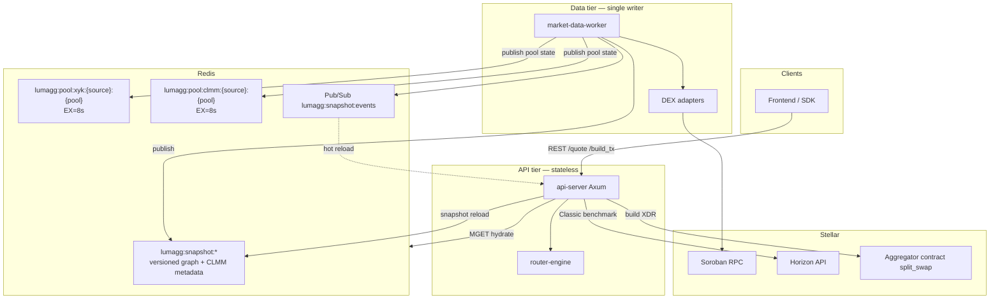
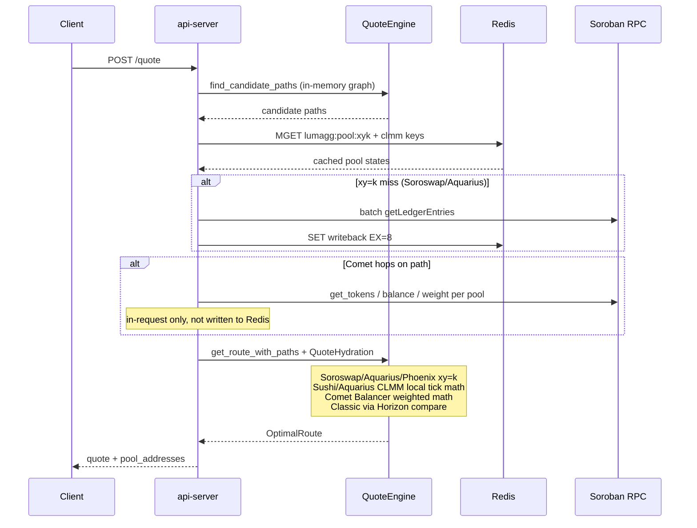

# Stellar DEX Aggregator (LumAgg)

[](https://github.com/ligulfzhou/stellar-dex-agg)

Multi-source liquidity aggregation router for Stellar's Soroban DEX ecosystem.

**Repository:** https://github.com/ligulfzhou/stellar-dex-agg

Aggregates liquidity across **Soroswap**, **Aquarius**, **Phoenix**, **Sushi V3**, **Comet**, and compares against **Classic DEX** (Horizon PathPayment) to find optimal swap execution — including multi-hop paths and split orders across venues.

## Architecture

Production deployment separates **slow-changing routing topology** from **fast-changing pool reserves**. The API stays stateless; a background worker owns writes to Redis.

### System overview



### Two data layers

| Layer | Contents | Where it lives | Update cadence |
|-------|----------|----------------|----------------|
| **Graph (topology)** | Token pairs, pool contract IDs, fee tiers, multi-token edges | `MarketSnapshot` in Redis (`lumagg:snapshot:current` + version history) or `data/snapshots/current.json` | **Discovery ~600s** — full `get_trading_pairs()` per adapter, replace edges per source |
| **Pool state (reserves / ticks)** | xy=k `reserve_a/b`; CLMM slot0, liquidity, ticks + **coverage**; Comet balances/weights at quote time | Redis `lumagg:pool:xyk:*` / `lumagg:pool:clmm:*` (**TTL 8s**) | **Refresh ~5s** on worker; **ledger watcher ~3s** for touched pools; **quote hydrate** for Redis misses |

The API does **not** keep a long-lived in-process pool cache (no 120s memory layer). Each `/quote` loads the graph from the last snapshot reload, then overlays fresh pool state via Redis + bounded RPC.

### Component responsibilities

```
┌──────────────────────────────────────────────────────────────────────────┐
│  Frontend (SvelteKit) / SDK                                               │
└───────────────────────────────┬──────────────────────────────────────────┘
                                │ REST: /quote, /tokens, /build_tx, …
┌───────────────────────────────▼──────────────────────────────────────────┐
│  api-server (Axum)                                                        │
│  • Snapshot mode: load MarketSnapshot → QuoteEngine graph (no discovery)  │
│  • quote_route: find paths → Redis MGET → hydrate misses → local math     │
│  • ClassicDexAdapter registered live (Horizon PathPayment per request)    │
└───────────────────────────────┬──────────────────────────────────────────┘
                                │
┌───────────────────────────────▼──────────────────────────────────────────┐
│  router-engine                                                            │
│  ┌────────────┐  ┌─────────────────┐  ┌──────────────────┐               │
│  │ PathFinder │  │ SplitOptimizer  │  │ TransactionBuilder│               │
│  │   (BFS)    │  │    (greedy)     │  │    (XDR / agg)    │               │
│  └─────┬──────┘  └────────┬────────┘  └─────────┬────────┘               │
│        └──────────────────┴──────────────────────┘                       │
│  QuoteEngine: local AMM/CLMM/Comet math + optional adapter get_quote      │
└───────────────────────────────┬──────────────────────────────────────────┘
                                │
┌───────────────────────────────▼──────────────────────────────────────────┐
│  market-data-worker (sole snapshot + Redis pool-state writer)             │
│  ┌─────────────────────────────────────────────────────────────────────┐ │
│  │ Loop A — discovery (DISCOVERY_INTERVAL_SECS, default 600)            │ │
│  │   Soroswap / Aquarius / Phoenix / Sushi / Comet / Aquarius CLMM      │ │
│  │   → build MarketSnapshot → publish Redis/file → rebuild pool index   │ │
│  ├─────────────────────────────────────────────────────────────────────┤ │
│  │ Loop B — refresh (REFRESH_INTERVAL_SECS, default 5)                  │ │
│  │   adapter.refresh_reserves() → update snapshot reserves + Redis    │ │
│  ├─────────────────────────────────────────────────────────────────────┤ │
│  │ Loop C — ledger watcher (LEDGER_POLL_SECS, default 3, needs Redis)   │ │
│  │   getLatestLedger + getEvents → touched known pools → partial refresh│ │
│  │   → Redis writeback only (no extra snapshot publish)                 │ │
│  └─────────────────────────────────────────────────────────────────────┘ │
└───────────────────────────────┬──────────────────────────────────────────┘
                                │ dex-adapters + SorobanRpc
┌───────────────────────────────▼──────────────────────────────────────────┐
│  Stellar: Soroban pools + optional Aggregator contract (atomic split_swap) │
└──────────────────────────────────────────────────────────────────────────┘
```

### Quote request flow (`/api/v1/quote`)

Snapshot-mode API path (recommended for production):



Steps in code (`state::quote_route` → `pool_hydrate` → `quote_engine`):

1. **Path discovery (graph only)** — BFS on cached `TradingPair` edges from last snapshot reload.
2. **Collect pool keys** — unique `(source, pool_address)` across candidate paths.
3. **Redis MGET** — one round trip for `lumagg:pool:xyk:*` and `lumagg:pool:clmm:*`.
4. **xy=k RPC fallback** — batch `getLedgerEntries` for Soroswap/Aquarius misses (cap `QUOTE_HYDRATE_MAX_POOLS`, default 32); write back to Redis with EX=8.
5. **Comet hydrate** — per Comet pool on path: read tokens, balances, normalized/denorm weights; held in `QuoteHydration.comet_pools` for this request only.
6. **Route + split** — simulate hops with local math; compare best Soroban route vs Classic single-path (Horizon) when both exist.
7. **CLMM guard** — hops skip or fail when tick coverage is incomplete (`coverage.is_complete`).

### DEX sources and discovery

| Source | Pool type | Graph discovery | Reserve / state refresh | Quote math |
|--------|-----------|-----------------|-------------------------|------------|
| **soroswap** | xy=k (Uniswap V2) | Factory `all_pairs` | Instance reserves; ledger batch refresh | Constant product, 0.3% fee |
| **aquarius** | xy=k + stable | On-chain pool list | Instance reserves | xy=k or stable math (3-token pool pending) |
| **phoenix** | xy=k (fee on output) | Factory pool query | Factory `query_all_pools_details` | Phoenix fee-on-output formula |
| **sushi** | CLMM V3 | Known addresses + factory storage (stellar.expert) + fallback; `SUSHI_DISCOVERY_RPC` | slot0 + ticks via pool-lens; coverage tracked | Local `clmm_math` |
| **aquarius_clmm** | CLMM | Router / configured pools | Tiered slot0 + conditional tick rescan | Local `clmm_math` + coverage |
| **comet** | Weighted (Balancer) | Factory `IsCpool` (expert) + `NEW_POOL` events + seeds | `refresh_pool` per tracked pool | **Balancer** `comet_math` when hydrated |
| **classic_dex** | Native orderbook + pools | **No graph** — not in snapshot topology | **Per quote** Horizon PathPayment | Benchmark / fallback only |

**Comet** factory (mainnet): `CA2LVIPU6HJHHPPD6EDDYJTV2QEUBPGOAVJ4VIYNTMFUCRM4LFK3TJKF` — override with `COMET_FACTORY`. Optional `COMET_EXTRA_POOLS` for manual pool IDs.

**Classic DEX** is intentionally outside the pool graph: Stellar Core controls PathPayment routing. The API calls Horizon at quote time and picks the better of Soroban-local routes vs Classic — Classic does not participate in multi-hop graph search.

### Ledger watcher (incremental updates)

There is no Soroban WebSocket; the worker **polls** RPC:

```text
getLatestLedger
  → getEvents [last+1 .. latest]  (contract filter, topics **)
  → intersect event.contractId with KnownPoolIndex (from snapshot graph + CLMM list)
  → partial refresh touched pools only
  → Redis SET (xyk always; clmm only if coverage.is_complete)
```

Does **not** publish a new `MarketSnapshot` on each ledger tick (Redis pool keys only). Full discovery + refresh loops remain the safety net.

### CLMM Redis policy

Incomplete tick windows must not be shared across API instances:

- `coverage.is_complete == true` → worker and quote hydrate may `SET lumagg:pool:clmm:...` (EX=8).
- Incomplete / missing coverage → no Redis write; quote engine skips or rejects those hops.

See [`docs/pool-state-architecture.md`](docs/pool-state-architecture.md) for implementation pointers and env tables.

## Key Features

- **Multi-source aggregation**: Soroswap, Aquarius, Phoenix, Sushi V3, Comet weighted pools
- **Split orders**: Greedy split across paths when price impact exceeds threshold
- **Multi-hop routing**: BFS through intermediate tokens (configurable max hops)
- **Snapshot + Redis pool state**: Horizontally scalable API tier; single worker writer
- **Sub-10s pool freshness**: 8s Redis TTL + 5s refresh + ~3s ledger touch updates
- **Atomic on-chain execution**: Optional aggregator contract `split_swap`
- **Classic comparison**: Horizon PathPayment benchmark without polluting the Soroban graph

## Why not Classic DEX for routing?

Stellar's native PathPayment has **uncontrollable routing** — Stellar Core decides how to split across orderbooks and liquidity pools. You cannot force a specific pool or path.

This aggregator targets **Soroban DEXes** where each hop is a deterministic contract call with predictable output. Classic is used as a **per-quote benchmark** (and fallback for tokens only on the native DEX), not as edges in the pathfinder graph.

## Project Structure

```
├── contracts/aggregator/       # Soroban smart contract (atomic split_swap)
├── crates/
│   ├── market-snapshot/        # MarketSnapshot schema, file/Redis store, pool_state_store
│   ├── market-data-worker/     # Discovery, refresh, ledger watcher, snapshot publisher
│   ├── dex-adapters/           # Per-DEX adapters, Soroban RPC, batch refresh, pool index
│   ├── router-engine/          # PathFinder, QuoteEngine, split optimizer, tx builder
│   ├── api-server/             # REST API, snapshot loader, pool_hydrate
│   └── sdk/                    # Client SDK
├── docs/
│   └── pool-state-architecture.md
├── deploy/                     # systemd units (api@, worker)
└── frontend/                   # SvelteKit demo
```

## Development

```bash
# Check compilation
cargo check --workspace --exclude aggregator-contract

# Run tests
cargo test --workspace --exclude aggregator-contract

# Run API server (legacy in-process discovery — dev only)
cargo run -p api-server

# File-backed snapshot worker + API
SNAPSHOT_DIR=data/snapshots cargo run -p market-data-worker
SNAPSHOT_DIR=data/snapshots cargo run -p api-server

# Redis-backed production-style stack
redis-server --port 6380 --save "" --appendonly no

SNAPSHOT_BACKEND=redis \
SNAPSHOT_REDIS_URL=redis://127.0.0.1:6380/ \
SNAPSHOT_REDIS_CHANNEL=lumagg:snapshot:events \
SNAPSHOT_REDIS_KEEP_LATEST=3 \
cargo run -p market-data-worker

LISTEN_ADDR=127.0.0.1:3113 \
SNAPSHOT_BACKEND=redis \
SNAPSHOT_REDIS_URL=redis://127.0.0.1:6380/ \
SNAPSHOT_REDIS_CHANNEL=lumagg:snapshot:events \
SNAPSHOT_POLL_INTERVAL_MS=250 \
cargo run -p api-server --bin api-server
```

### Environment variables (common)

| Variable | Default | Component | Meaning |
|----------|---------|-----------|---------|
| `RPC_URL` | mainnet gateway.fm | all | Soroban JSON-RPC |
| `SNAPSHOT_BACKEND` | — | worker, API | `file` or `redis` (redis if `SNAPSHOT_REDIS_URL` set) |
| `SNAPSHOT_REDIS_URL` | — | worker, API | Redis for snapshots + pool state |
| `SNAPSHOT_REDIS_CHANNEL` | `lumagg:snapshot:events` | worker, API | Pub/Sub for hot reload |
| `SNAPSHOT_POLL_INTERVAL_MS` | `1000` | API | Polling fallback if Pub/Sub missed |
| `DISCOVERY_INTERVAL_SECS` | `600` | worker | Full graph rediscovery |
| `REFRESH_INTERVAL_SECS` | `5` | worker | Reserve / CLMM refresh |
| `POOL_STATE_TTL_SECS` | `8` | worker, API | Redis EX on pool keys |
| `QUOTE_HYDRATE_MAX_POOLS` | `32` | API | Max xy=k RPC hydrates per quote |
| `LEDGER_WATCHER_ENABLED` | `true` | worker | Requires Redis pool store |
| `LEDGER_POLL_SECS` | `3` | worker | Ledger poll interval |
| `SUSHI_DISCOVERY_RPC` | public gateway | worker | RPC used for Sushi pool probes |
| `COMET_FACTORY` | Blend mainnet factory | worker | Comet factory contract |
| `COMET_EXTRA_POOLS` | — | worker | Comma-separated extra Comet pool IDs |

## License

MIT
