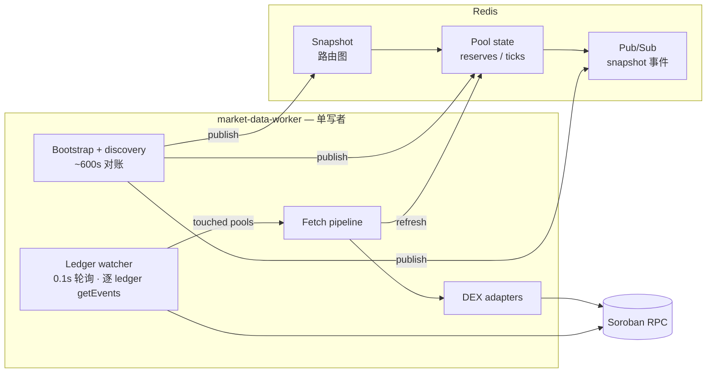
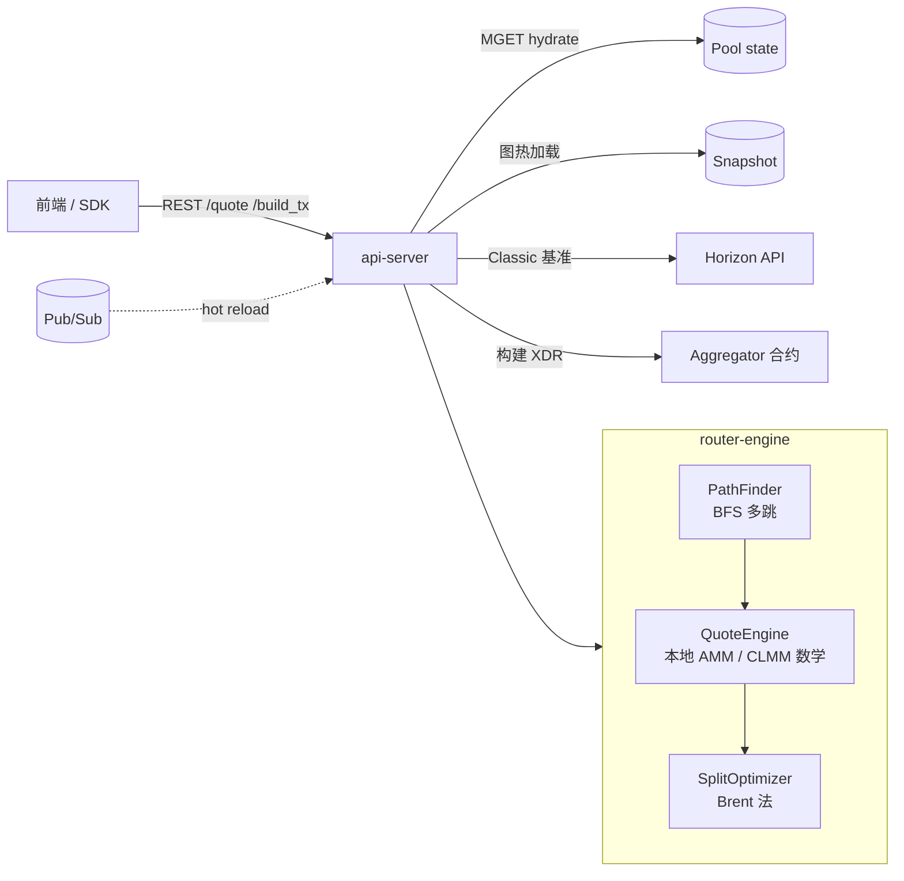
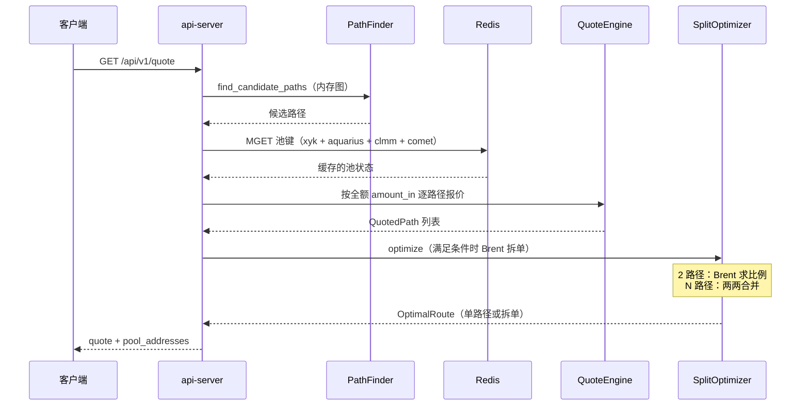

# Stellar DEX 聚合器 (LumAgg)

[](https://github.com/Lum-Agg/stellar-dex-agg)
[](LICENSE)

Stellar Soroban 生态的多源流动性聚合路由。

**仓库：** https://github.com/Lum-Agg/stellar-dex-agg  
**English:** [README.md](README.md)

LumAgg 在 **Soroswap**、**Aquarius**（xy=k、稳定币、CLMM）、**Phoenix**、**Sushi V3**、**Comet** 之间路由 swap，并可与 **Classic DEX**（Horizon PathPayment）做基准对比。支持多跳路径、跨池拆单，以及通过可选聚合合约原子执行。

## 目录

- [架构](#架构)
- [DEX 数据源](#dex-数据源)
- [核心特性](#核心特性)
- [为何不用 Classic DEX 路由？](#为何不用-classic-dex-路由)
- [项目结构](#项目结构)
- [开发](#开发)
- [部署](#部署)
- [配置](#配置)
- [拆单路由](#拆单路由)
- [相关文档](#相关文档)
- [许可证](#许可证)

## 架构

### 设计原则

| 原则 | 实现 |
|------|------|
| **拓扑与状态分离** | 路由图（交易对、池地址、费率）与实时 reserves / ticks 分开存储 |
| **单写者** | `market-data-worker` 独占 Redis 写入；`api-server` 无状态 |
| **事件驱动新鲜度** | Ledger 事件只刷新*被触碰*的池；不做周期性全市场扫描 |
| **冷池仍有效** | 无链上活动的池保留 Redis 中上次写入的值，直到被覆盖 |

池状态更新三条通道：**bootstrap**（worker 启动）、**ledger watcher**（热路径，0.1s 轮询）、**discovery**（约 600s 对账）。详见 [`docs/pool-state-architecture.md`](docs/pool-state-architecture.md)。

### 系统总览

两条数据流共享同一 Redis。

**1 — 池状态写入（`market-data-worker`）**



**2 — 报价读取（`api-server`）**



路径发现并从 Redis 灌入池状态后，**QuoteEngine** 对每条候选路径做本地报价，再由 **SplitOptimizer** 决定全额走单路径还是拆分到多条路径。双路径时用 **Brent 法**（约 10 次评估、0.01% 容差）求最优输入比例；多路径时两两合并（2 路径用递归 Brent，3+ 路径用按输出加权的初值）。仅当价格冲击超过 `SPLIT_THRESHOLD_BPS`，或竞争路径落在 `SPLIT_COMPETITIVE_DELTA_BPS` 内时才尝试拆单。详见 [拆单路由](#拆单路由)。

**Redis 键**（池键 `EX=86400`）：

| 键模式 | 内容 |
|--------|------|
| `lumagg:snapshot:*` | 版本化路由图 + CLMM 元数据（无 reserves） |
| `lumagg:pool:xyk:{source}:{pool}` | xy=k reserves |
| `lumagg:pool:aquarius:{pool}` | Aquarius 多币 / 稳定币 reserves |
| `lumagg:pool:comet:{pool}` | Comet 加权池（各 token balance + weight + fee） |
| `lumagg:pool:clmm:{source}:{pool}` | CLMM slot0、流动性、ticks |
| `lumagg:snapshot:events` | Snapshot 热加载 Pub/Sub 频道 |

### 数据分层

| 层 | 内容 | 存储 | 更新频率 |
|----|------|------|----------|
| **图** | 交易对、池地址、费率；CLMM 引用（无 tick） | `lumagg:snapshot:*` | Bootstrap；discovery ~600s |
| **池状态** | xy=k reserves；Aquarius 多币；Comet 加权；CLMM slot0 + ticks + coverage | `lumagg:pool:*` | Ledger 0.1s 轮询 touched 池；bootstrap + discovery 全量发布 |

API **不**在进程内长期缓存池状态。每次 `/quote` 从最新 snapshot 重载路由图，再从 Redis 覆盖池状态（默认 `QUOTE_RPC_HYDRATE_ENABLED=false`）。

### 报价请求流程



代码步骤：

1. **路径发现** — 在路由图上 BFS；返回全部候选路径（不按流动性剪枝）。
2. **收集池键** — 路径上唯一的 `(source, pool_address)`。
3. **Hydrate 池状态**（`pool_hydrate::hydrate_paths`）— Redis MGET 拉 xy=k、Aquarius、CLMM、Comet 加权状态（由 worker 写入）。`QUOTE_RPC_HYDRATE_ENABLED=true` 时 Soroswap xy=k / Comet Redis miss 可 RPC 兜底。
4. **逐路径报价** — 以全额 `amount_in` 做本地 AMM / CLMM / Comet 计算；`coverage.is_complete` 为 false 的 CLMM 跳跳过。
5. **拆单优化** — `SplitOptimizer`：冲击低于阈值则跳过；否则 Brent 法（2 路径）或两两合并（N 路径）最大化总输出。
6. **Classic 对比** — 可选 Horizon PathPayment 与最优 Soroban 路由比较。

### Ledger watcher（热路径）

Stellar Soroban RPC 无 WebSocket / Geyser 推送 — worker **轮询** `getLatestLedger`（**0.1s**），再**逐 ledger** 拉事件：

```text
getLatestLedger
  → 对每个新 ledger N：
      getEvents(N, N+1)
      → contractId 匹配 KnownPoolIndex（池合约 + router 事件解析）
      → fetch pipeline：仅 RPC 刷新 touched 池
      → Redis SET（CLMM 仅当 coverage.is_complete）
```

活跃池在链上 swap / 加减仓后通常 **~0.1–2s** 内刷新。

**CLMM 策略：** tick 数据在池合约 storage 中。Worker 仅在 `coverage.is_complete` 时写 Redis；否则报价引擎跳过该跳。

## DEX 数据源

| 来源 | 池类型 | 在路由图中 | Redis 池状态 | 报价数学 |
|------|--------|------------|--------------|----------|
| **soroswap** | xy=k | 是 | Discovery + ledger | 恒定乘积 |
| **aquarius** | xy=k + stable | 是 | Discovery + ledger | xy=k / stable |
| **phoenix** | xy=k | 是 | Discovery + ledger | 输出扣费 |
| **sushi** | CLMM V3 | 是 | Discovery + ledger | 本地 `clmm_math` |
| **aquarius_clmm** | CLMM | 是 | Discovery + ledger | 本地 `clmm_math` |
| **comet** | 加权 | 是 | Discovery + ledger（`lumagg:pool:comet:*`） | Balancer 数学 |
| **classic_dex** | 原生订单簿 | **否** | **按报价**（Horizon） | 仅基准 |

## 核心特性

- **多源聚合** — 六大 Soroban DEX 家族
- **多跳路由** — BFS 经中间代币（可配置最大跳数）
- **拆单** — 冲击或路径竞争足够时，Brent 优化器跨路径分配输入
- **事件驱动池状态** — ledger watcher + discovery；无周期性全量扫描
- **API 水平扩展** — 无状态 `api-server` 可挂负载均衡
- **热池亚 2 秒新鲜度** — 0.1s ledger 轮询 + fetch pipeline
- **链上原子执行** — 可选聚合合约（`split_swap`、`round_trip_swap`）
- **Classic 基准** — 每单 Horizon PathPayment，不污染 Soroban 图

## 为何不用 Classic DEX 路由？

原生 PathPayment 的**路由不可控** — Stellar Core 自行决定如何在订单簿与池之间拆分。无法指定具体池或路径。

本聚合器面向 **Soroban DEX**，每一跳是确定性合约调用。Classic DEX 仅作**每单基准**（及仅存在于原生 DEX 的代币兜底），不是 pathfinder 图中的边。

## 项目结构

```
├── contracts/aggregator/       # Soroban 合约（split_swap, round_trip_swap）
├── crates/
│   ├── market-snapshot/        # MarketSnapshot 模式、Redis pool_state_store
│   ├── market-data-worker/     # Discovery、ledger watcher、fetch pipeline
│   ├── dex-adapters/           # 各 DEX 适配器、RPC、pool index、router events
│   ├── router-engine/          # PathFinder、QuoteEngine、split_optimizer（Brent）
│   ├── api-server/             # REST API（/quote、/build_tx、/tokens）
│   ├── arbitrage/              # 往返套利扫描（aggregator.round_trip_swap）
│   ├── lumagg-alerts/          # Telegram / 监控告警
│   └── sdk/                    # 客户端 SDK
├── docs/
│   └── pool-state-architecture.md
├── thirdparty/                 # 可选：本地 clone 上游参考（不入库；见 README）
├── deploy/                     # systemd 单元（lumagg-api@、lumagg-worker）
├── deploy_server.sh            # 远程 rsync + 构建 + 重启
└── frontend/                   # SvelteKit 演示 UI
```

## 上游参考（thirdparty）

各 DEX 上游仓库**不**纳入 git。改 adapter 时需对照合约布局 / mainnet 地址清单时，clone 到 `thirdparty/` — 见 [thirdparty/README.md](./thirdparty/README.md)。构建与部署不依赖该目录。

## 开发

```bash
# 编译
cargo check --workspace --exclude aggregator-contract

# 测试
cargo test --workspace --exclude aggregator-contract

# 本地文件后端（开发）
SNAPSHOT_DIR=data/snapshots cargo run -p market-data-worker
SNAPSHOT_DIR=data/snapshots cargo run -p api-server

# 本地 Redis 后端（类生产）
redis-server --port 6380 --save "" --appendonly no

SNAPSHOT_BACKEND=redis \
SNAPSHOT_REDIS_URL=redis://127.0.0.1:6380/ \
SNAPSHOT_REDIS_CHANNEL=lumagg:snapshot:events \
cargo run -p market-data-worker

LISTEN_ADDR=127.0.0.1:3113 \
SNAPSHOT_BACKEND=redis \
SNAPSHOT_REDIS_URL=redis://127.0.0.1:6380/ \
SNAPSHOT_REDIS_CHANNEL=lumagg:snapshot:events \
cargo run -p api-server
```

**工具二进制**（`dex-adapters`）：

```bash
# 审计 ledger 事件 → touched pools（链上）
RPC_URL=... REDIS_URL=... AUDIT_LEDGERS=30 \
  cargo run -p dex-adapters --release --bin audit-ledger-events

# 按 ledger 导出事件到 JSONL
DUMP_DIR=./ledger-events-dump DUMP_LEDGERS=5 \
  cargo run -p dex-adapters --release --bin dump-ledger-events
```

## 部署

```bash
./deploy_server.sh          # api-server（4 实例）+ worker
./deploy_server.sh api      # 仅 api-server
./deploy_server.sh worker   # 仅 market-data-worker
```

Systemd 单元在 `deploy/`：

| 单元 | 角色 |
|------|------|
| `lumagg-worker.service` | 单写者 — discovery、ledger watcher、Redis 发布 |
| `lumagg-api@.service` | 无状态 API 实例（端口 3100–3103） |

Worker 默认：`LEDGER_POLL_SECS=0.1`、`FETCH_PIPELINE_ENABLED=true`、`DISCOVERY_INTERVAL_SECS=600`。

## 配置

### 通用

| 变量 | 默认 | 含义 |
|------|------|------|
| `RPC_URL` | mainnet gateway.fm | Soroban JSON-RPC |

### Snapshot 与 Redis

| 变量 | 默认 | 组件 | 含义 |
|------|------|------|------|
| `SNAPSHOT_BACKEND` | — | worker, API | `file` 或 `redis` |
| `SNAPSHOT_REDIS_URL` | — | worker, API | Redis URL |
| `SNAPSHOT_REDIS_CHANNEL` | `lumagg:snapshot:events` | worker, API | Snapshot 热加载 Pub/Sub |
| `SNAPSHOT_POLL_INTERVAL_MS` | `1000` | API | Pub/Sub 漏消息时的轮询兜底 |
| `POOL_STATE_TTL_SECS` | `86400` | worker | 池键 Redis EX（淘汰用，非新鲜度 SLA） |

### Worker — discovery 与 ledger

| 变量 | 默认 | 含义 |
|------|------|------|
| `DISCOVERY_INTERVAL_SECS` | `600` | 全图重发现 + Redis 池发布 |
| `REFRESH_INTERVAL_SECS` | `5` | 适配器缓存刷新（供 discovery） |
| `LEDGER_WATCHER_ENABLED` | `true` | 需要 Redis 池存储 |
| `LEDGER_POLL_SECS` | `0.1` | Ledger 轮询间隔（最小 `0.1`） |
| `LEDGER_MAX_CATCHUP` | `32` | 积压后单次轮询最多 ingest 的 ledger 数 |
| `FETCH_PIPELINE_ENABLED` | `true` | Ledger touched → 任务队列 → Redis |
| `FETCH_WORKER_COUNT` | `8` | Fetch pipeline 并发 RPC worker |
| `POOL_STATE_REFRESH_CONCURRENCY` | `8` | getLedgerEntries 批处理并发 |

### API — 报价与路由

| 变量 | 默认 | 含义 |
|------|------|------|
| `QUOTE_RPC_HYDRATE_ENABLED` | `false` | Redis miss 时 RPC 兜底（应急） |
| `QUOTE_HYDRATE_MAX_POOLS` | `12` | 启用时单次 quote 最多 RPC hydrate 的 xy=k 池数 |
| `PATH_FINDER_MAX_HOPS` | `3` | 单路径最大跳数 |
| `PATH_FINDER_MAX_MULTI_HOP_PATHS` | `50` | 每单 2+ 跳路径上限 |
| `PATH_FINDER_MAX_DIRECT_PATHS` | `0` | 1 跳池上限（`0` = 不限制） |
| `MAX_SPLITS` | `5` | 拆单候选路径上限 |
| `SPLIT_THRESHOLD_BPS` | `5` | 触发拆单的最低价格冲击（bps） |
| `SPLIT_COMPETITIVE_DELTA_BPS` | `50` | 次优路径与最优相差在此 bps 内也尝试拆单 |
| `MIN_SPLIT_FRACTION_BPS` | `5` | 低于此输出占比的拆单腿丢弃 |

### DEX discovery 覆盖

| 变量 | 默认 | 含义 |
|------|------|------|
| `SUSHI_DISCOVERY_RPC` | public gateway | Sushi 池探测 RPC |
| `COMET_FACTORY` | Blend mainnet factory | Comet factory 合约 |
| `COMET_EXTRA_POOLS` | — | 额外 Comet 池 ID（逗号分隔） |

## 拆单路由

生产环境 `deploy/lumagg-api@.service` 显式设置拆单相关环境变量。

**SplitOptimizer**（`crates/router-engine/src/split_optimizer.rs`）在 QuoteEngine 内、每条路径按全额报价之后运行：

| 情况 | 算法 |
|------|------|
| 冲击 &lt; `SPLIT_THRESHOLD_BPS` 且路径不竞争 | 单路径最优（不拆单） |
| 2 条路径 | **Brent 法** 在 `[0, 1]` 上最大化 `out_a(x) + out_b(1−x)` |
| 3+ 条路径 | 两两递归 Brent 合并；3+ 初值按各路径全额输出加权 |

Brent 默认容差 `0.0001`（0.01%），最多 18 次迭代 — 思路类似 Jupiter Iris（黄金分割 + Brent）。

- **`SPLIT_THRESHOLD_BPS=5`（0.05%）** — 估计冲击 ≥ 5 bps，或竞争路径在 `SPLIT_COMPETITIVE_DELTA_BPS` 内且冲击 &gt; 0 时拆单。
- **`SPLIT_THRESHOLD_BPS=1`（0.01%）** — 通常不值得：优化开销大，很多报价仍返回 `split_rejected_reason: "no_improvement"`。
- `/quote?debug=1` 可查看 `split_attempted`、`split_threshold_bps`、`split_rejected_reason`、`split_method`（如 `two_path_brent`）。

## 相关文档

| 文档 | 主题 |
|------|------|
| [`docs/pool-state-architecture.md`](docs/pool-state-architecture.md) | 池状态设计、环境变量、代码索引 |
| [`docs/scf-venue-comparison.md`](docs/scf-venue-comparison.md) | LumAgg vs Soroswap / Stellar Broker — venue 覆盖与 SCF 差异化证据 |
| [`docs/scf-resubmission-budget.md`](docs/scf-resubmission-budget.md) | SCF #44 重新提交 — $80k 三档 deliverables |
| [`docs/scf-benchmark-results.md`](docs/scf-benchmark-results.md) | 实时 quote 对比结果（`./scripts/scf-benchmark.sh`） |
| [`docs/arb-executor.md`](docs/arb-executor.md) | 原子套利运营栈（vault + `round_trip_swap` bot） |

## 许可证

Apache-2.0。见 [LICENSE](LICENSE)。
