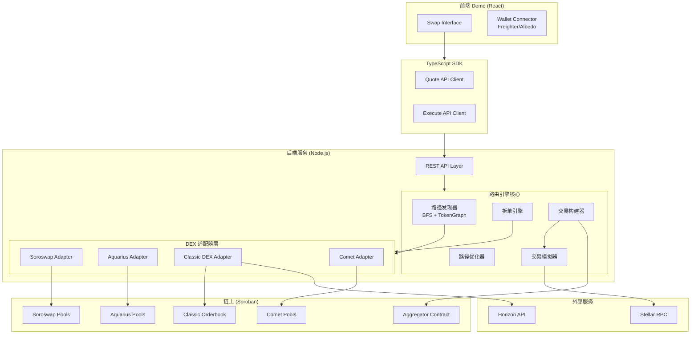
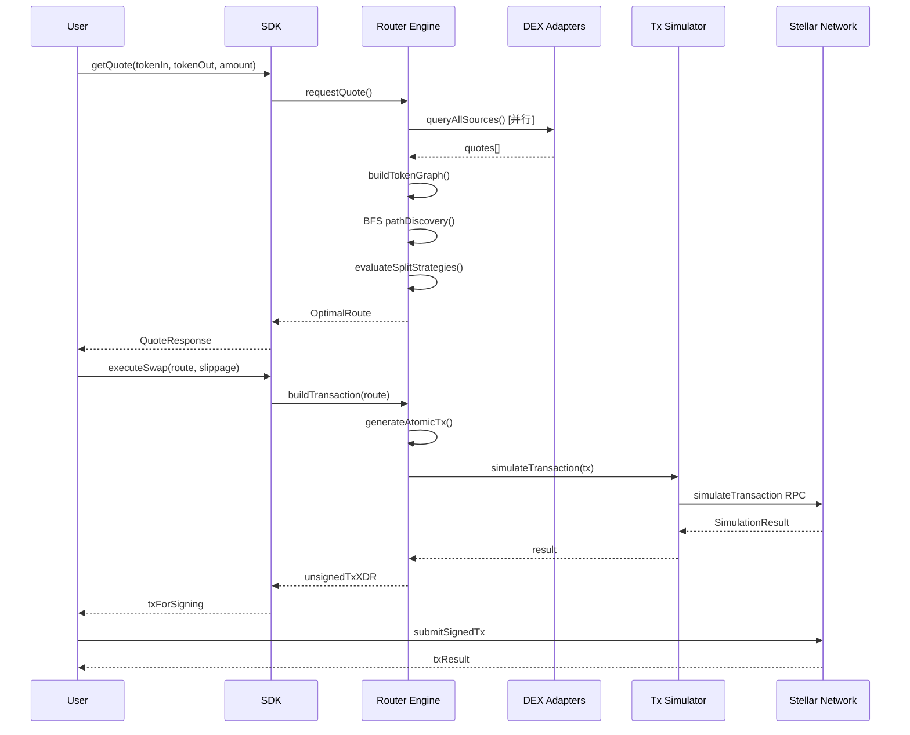
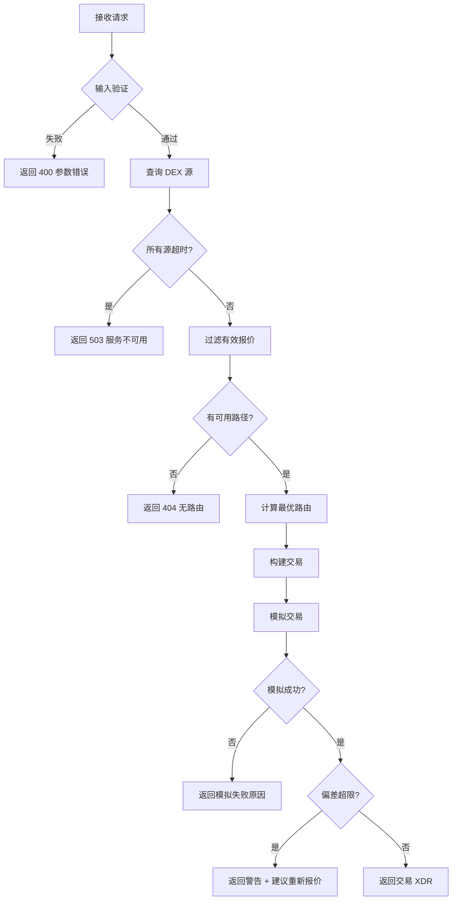

# Design Document: Stellar DEX Aggregator

## Overview

Stellar DEX Aggregator 是一个多源流动性聚合路由引擎，为 Stellar 生态中的交易者提供跨 DEX 最优交易执行方案。系统聚合 Soroswap、Aquarius、Stellar Classic DEX 和 Comet 四个流动性源，通过智能路由算法（BFS 路径发现 + 拆单优化）计算最优交易路径，并生成原子交易确保执行安全性。

### 核心设计目标

1. **最优执行**: 通过多源聚合和拆单策略，为用户获取最大输出金额
2. **原子性保证**: 所有子交易要么全部成功要么全部回滚，无中间状态风险
3. **可扩展性**: 插件化适配器架构，新增 DEX 源无需修改核心逻辑
4. **低延迟**: 报价计算 < 3 秒，并行查询多个 DEX 源

### 技术栈

| 层级 | 技术选型 | 说明 |
|------|----------|------|
| 链上合约 | Rust (Soroban) | 聚合合约，执行链上拆单和多路径交易 |
| 后端/路由引擎 | TypeScript / Node.js | 核心路由计算、API 服务 |
| SDK | TypeScript | 提供给第三方开发者的集成库 |
| 前端 Demo | React + TypeScript | 交互式 Swap 界面 |

### 研究发现

基于对 Stellar 生态 DEX 协议的研究，关键发现如下：

- **Soroswap**: Uniswap V2 风格的 Soroban AMM，已有自己的 Aggregator 合约（支持 Soroswap + Phoenix + Aqua），其 API 可作为参考
- **Aquarius**: 提供 `swap_chained` 函数，支持最多 4 个池的链式交换，合约地址 `CBQDHNBFBZYE4MKPWBSJOPIYLW4SFSXAXUTSXJN76GNKYVYPCKWC6QUK`
- **Stellar Classic DEX**: 通过 `path_payment_strict_send` / `path_payment_strict_receive` 操作实现，Horizon API 提供路径发现
- **Comet**: 加权池 AMM 协议（类似 Balancer），支持多资产池
- **交易模拟**: Stellar RPC 提供 `simulateTransaction` 端点，可在提交前验证交易

## Architecture

### 系统架构图



### 数据流



## Components and Interfaces

### 1. DEX Source Adapter Trait (Rust)

所有 DEX 适配器必须实现的标准 trait：

```rust
use stellar_sdk::types::{Asset, Operation};
use anyhow::Result;

/// 代币标识
#[derive(Clone, Debug, PartialEq, Eq, Hash)]
pub enum TokenId {
    Native,
    Classic { code: String, issuer: String },
    Soroban { contract: String },
}

/// 标准化报价
#[derive(Clone, Debug)]
pub struct Quote {
    pub source: String,
    pub token_in: TokenId,
    pub token_out: TokenId,
    pub amount_in: i128,
    pub amount_out: i128,
    /// 价格影响 (basis points, 如 50 = 0.5%)
    pub price_impact_bps: u32,
    pub fee: FeeInfo,
    /// 路径中的中间代币
    pub path: Vec<TokenId>,
    /// 报价时间戳 (unix ms)
    pub timestamp: u64,
}

/// 费用信息
#[derive(Clone, Debug)]
pub struct FeeInfo {
    /// 协议费率 (basis points)
    pub protocol_fee_bps: u32,
    /// 网络费用估算 (stroops)
    pub network_fee: i64,
}

/// 交易对
#[derive(Clone, Debug)]
pub struct TradingPair {
    pub token_a: TokenId,
    pub token_b: TokenId,
    pub source: String,
    pub liquidity_a: Option<i128>,
    pub liquidity_b: Option<i128>,
}

/// Swap 操作描述（用于交易构建）
#[derive(Clone, Debug)]
pub enum SwapOperation {
    /// Classic DEX path payment
    ClassicPathPayment {
        send_asset: Asset,
        dest_asset: Asset,
        send_amount: i64,
        dest_min: i64,
        path: Vec<Asset>,
    },
    /// Soroban 合约调用
    SorobanInvoke {
        contract_id: String,
        function_name: String,
        args: Vec<soroban_sdk::xdr::ScVal>,
    },
}

/// DEX 适配器 trait
#[async_trait::async_trait]
pub trait DexAdapter: Send + Sync {
    /// 适配器唯一标识
    fn id(&self) -> &str;
    /// 适配器名称
    fn name(&self) -> &str;
    /// 协议类型
    fn protocol_type(&self) -> ProtocolType;

    /// 查询支持的交易对
    async fn get_available_pairs(&self) -> Result<Vec<TradingPair>>;

    /// 获取报价
    async fn get_quote(
        &self,
        token_in: &TokenId,
        token_out: &TokenId,
        amount_in: i128,
    ) -> Result<Option<Quote>>;

    /// 生成 swap 操作参数
    async fn build_swap_operation(
        &self,
        token_in: &TokenId,
        token_out: &TokenId,
        amount_in: i128,
        min_amount_out: i128,
    ) -> Result<SwapOperation>;

    /// 健康检查
    async fn health_check(&self) -> bool;
}

#[derive(Clone, Debug)]
pub enum ProtocolType {
    SorobanAmm,
    SorobanWeightedPool,
    ClassicDex,
}
```

### 2. Path Finder（路径发现器）

```rust
use std::collections::{HashMap, HashSet, VecDeque};

/// 代币图的边信息
#[derive(Clone, Debug)]
pub struct Edge {
    pub target: TokenId,
    pub source: String,  // DEX adapter id
    pub pool_address: Option<String>,
    pub fee_rate_bps: u32,
    pub last_updated: u64,
}

/// 代币图
pub struct TokenGraph {
    adjacency: HashMap<TokenId, Vec<Edge>>,
}

/// 发现的路径
#[derive(Clone, Debug)]
pub struct Path {
    pub tokens: Vec<TokenId>,
    pub sources: Vec<String>,  // 每一跳使用的 DEX
    pub hop_count: usize,
}

impl TokenGraph {
    pub fn new() -> Self { ... }

    /// 添加交易对边（双向）
    pub fn add_edge(&mut self, token_a: &TokenId, token_b: &TokenId, edge: Edge) { ... }

    /// 移除边
    pub fn remove_edges_by_source(&mut self, source: &str) { ... }

    /// BFS 搜索所有路径
    pub fn find_paths(
        &self,
        start: &TokenId,
        end: &TokenId,
        max_hops: usize,
        bridge_tokens: &[TokenId],
    ) -> Vec<Path> { ... }
}

/// 路径发现器
pub struct PathFinder {
    graph: TokenGraph,
    /// 桥接代币（XLM, USDC 等高流动性代币，用于多跳路径发现）
    bridge_tokens: Vec<TokenId>,
    /// 路径缓存
    cache: HashMap<(TokenId, TokenId), CachedPaths>,
}

impl PathFinder {
    /// 更新图谱（从某个 DEX 适配器获取的交易对）
    pub fn update_from_adapter(&mut self, pairs: Vec<TradingPair>, source: &str) { ... }

    /// 发现路径
    pub fn discover_paths(
        &mut self,
        token_in: &TokenId,
        token_out: &TokenId,
        max_hops: usize,
    ) -> Vec<Path> { ... }

    /// 失效缓存
    pub fn invalidate(&mut self, token_a: &TokenId, token_b: &TokenId) { ... }
}
```

### 3. Split Engine（拆单引擎）

```rust
/// 拆单子订单
#[derive(Clone, Debug)]
pub struct SubOrder {
    pub path: Path,
    pub source: String,
    pub amount_in: i128,
    pub expected_amount_out: i128,
    pub percentage: f64,  // 0.0 - 1.0
}

/// 最优路由结果
#[derive(Clone, Debug)]
pub struct OptimalRoute {
    pub sub_orders: Vec<SubOrder>,
    pub total_amount_in: i128,
    pub total_expected_out: i128,
    pub aggregate_price_impact_bps: u32,
    pub is_split: bool,
    /// 相比最优单路径的改善 (basis points)
    pub improvement_bps: u32,
}

pub struct SplitEngine;

impl SplitEngine {
    /// 判断是否需要拆单（单路径价格影响超过阈值）
    pub fn should_split(single_best: &Quote, threshold_bps: u32) -> bool { ... }

    /// 计算最优拆单方案
    /// 使用贪心 + 二分搜索：对每个候选路径，二分查找最优分配比例
    pub async fn optimize(
        &self,
        adapters: &[&dyn DexAdapter],
        paths: &[Path],
        total_amount: i128,
        max_splits: usize,
    ) -> Result<OptimalRoute> { ... }
}
```

### 4. Transaction Builder（交易构建器）

```rust
use stellar_sdk::{Transaction, TransactionBuilder as StellarTxBuilder};

pub struct TransactionBuilder {
    rpc_url: String,
    network_passphrase: String,
    aggregator_contract_id: Option<String>,
}

/// 未签名交易结果
#[derive(Debug)]
pub struct UnsignedTx {
    pub xdr: String,
    pub hash: String,
    pub operation_count: u32,
    pub estimated_fee: i64,
}

/// 模拟结果
#[derive(Debug)]
pub struct SimulationResult {
    pub success: bool,
    pub actual_output: Option<i128>,
    pub resource_cost: Option<i64>,
    pub error: Option<String>,
}

impl TransactionBuilder {
    /// 根据路由方案构建原子交易
    pub async fn build(
        &self,
        route: &OptimalRoute,
        user_address: &str,
        slippage_bps: u32,
    ) -> Result<UnsignedTx> { ... }

    /// 模拟交易
    pub async fn simulate(&self, tx_xdr: &str) -> Result<SimulationResult> { ... }

    /// 构建纯 Classic DEX 交易（多个 path_payment 操作）
    fn build_classic_tx(&self, ops: &[SwapOperation], user: &str) -> Result<Transaction> { ... }

    /// 构建 Soroban 聚合合约调用
    fn build_aggregator_invoke(
        &self,
        ops: &[SwapOperation],
        user: &str,
        min_total_out: i128,
    ) -> Result<Transaction> { ... }

    /// 混合交易：Classic + Soroban 操作在同一交易中
    fn build_mixed_tx(
        &self,
        classic_ops: &[SwapOperation],
        soroban_ops: &[SwapOperation],
        user: &str,
    ) -> Result<Transaction> { ... }
}
```

### 5. REST API (Axum)

```rust
use axum::{Router, Json, extract::Query};
use serde::{Deserialize, Serialize};

/// API 路由定义
pub fn api_router(engine: Arc<RouterEngine>) -> Router {
    Router::new()
        .route("/api/v1/quote", get(get_quote))
        .route("/api/v1/swap", post(build_swap))
        .route("/api/v1/simulate", post(simulate))
        .route("/api/v1/tokens", get(list_tokens))
        .route("/api/v1/health", get(health_check))
        .with_state(engine)
}

/// 报价请求
#[derive(Deserialize)]
pub struct QuoteQuery {
    pub token_in: String,
    pub token_out: String,
    pub amount_in: String,
    pub slippage_tolerance: Option<f64>,  // 默认 0.5
}

/// 报价响应
#[derive(Serialize)]
pub struct QuoteResponse {
    pub expected_output: String,
    pub minimum_output: String,
    pub price_impact: f64,
    pub route: RouteDetail,
    pub fees: FeeBreakdown,
    pub expires_at: u64,
}

#[derive(Serialize)]
pub struct RouteDetail {
    pub is_split: bool,
    pub sub_routes: Vec<SubRouteDetail>,
}

#[derive(Serialize)]
pub struct SubRouteDetail {
    pub source: String,
    pub path: Vec<String>,
    pub amount_in: String,
    pub amount_out: String,
    pub percentage: f64,
}

/// Swap 请求
#[derive(Deserialize)]
pub struct SwapRequest {
    pub token_in: String,
    pub token_out: String,
    pub amount_in: String,
    pub slippage_tolerance: f64,
    pub user_public_key: String,
}

/// Swap 响应
#[derive(Serialize)]
pub struct SwapResponse {
    pub unsigned_tx_xdr: String,
    pub simulation: SimulationDetail,
    pub route: RouteDetail,
}
```

### 6. TypeScript SDK（薄包装层）

```typescript
/**
 * Stellar DEX Aggregator SDK
 * 调用 Rust API 服务的 TypeScript 客户端
 */
export class StellarAggregator {
  private baseUrl: string;

  constructor(options: { apiUrl: string }) {
    this.baseUrl = options.apiUrl;
  }

  /** 获取报价 */
  async getQuote(params: {
    tokenIn: string;
    tokenOut: string;
    amountIn: string;
    slippageTolerance?: number;
  }): Promise<QuoteResponse> { ... }

  /** 构建 swap 交易（返回未签名 XDR） */
  async buildSwap(params: {
    tokenIn: string;
    tokenOut: string;
    amountIn: string;
    slippageTolerance: number;
    userPublicKey: string;
  }): Promise<SwapResponse> { ... }

  /** 模拟交易 */
  async simulate(params: {
    tokenIn: string;
    tokenOut: string;
    amountIn: string;
    slippageTolerance: number;
    userPublicKey: string;
  }): Promise<SimulationResponse> { ... }

  /** 获取支持的代币列表 */
  async getTokens(): Promise<TokenInfo[]> { ... }
}
```

### 7. Soroban Aggregator Contract Interface

```rust
// Soroban 聚合合约接口（Rust）
pub trait AggregatorContractTrait {
    /// 初始化合约
    fn initialize(env: Env, admin: Address);

    /// 执行多步骤聚合交换
    fn aggregate_swap(
        env: Env,
        user: Address,
        swap_ops: Vec<SwapOp>,
        token_in: Address,
        token_out: Address,
        amount_in: i128,
        min_amount_out: i128,
    ) -> i128;

    /// 注册支持的 DEX 协议
    fn register_protocol(env: Env, admin: Address, protocol_id: Symbol, contract_id: Address);

    /// 移除 DEX 协议
    fn remove_protocol(env: Env, admin: Address, protocol_id: Symbol);
}

/// 单个交换操作
pub struct SwapOp {
    /// 目标 DEX 协议标识
    pub protocol_id: Symbol,
    /// 目标合约地址
    pub contract_id: Address,
    /// 输入代币
    pub token_in: Address,
    /// 输出代币
    pub token_out: Address,
    /// 输入金额
    pub amount_in: i128,
    /// 最小输出金额
    pub min_amount_out: i128,
    /// 协议特定参数（如 pool_index 等）
    pub extra_params: Vec<Val>,
}
```

## Data Models

### 核心数据类型

```typescript
/** 代币标识 */
type TokenId = string;  // Stellar asset code:issuer 或 Soroban contract address

/** 交易对 */
interface TradingPair {
  tokenA: TokenId;
  tokenB: TokenId;
  source: string;
  /** 池子流动性（以 tokenA 计） */
  liquidityA?: bigint;
  /** 池子流动性（以 tokenB 计） */
  liquidityB?: bigint;
}

/** 费用信息 */
interface FeeInfo {
  /** 协议费率（百分比） */
  protocolFeePercent: number;
  /** 网络费用（stroops） */
  networkFee: bigint;
  /** 总费用（以输入代币计） */
  totalFeeAmount: bigint;
}

/** 路径 */
interface Path {
  tokens: TokenId[];
  sources: string[];  // 每一跳使用的 DEX 源
  hopCount: number;
}

/** 图的边元数据 */
interface EdgeMetadata {
  /** 池子合约地址 */
  poolAddress?: string;
  /** 池子索引（Aquarius 使用） */
  poolIndex?: string;
  /** 费率 */
  feeRate: number;
  /** 最后更新时间 */
  lastUpdated: number;
}

/** 代币信息 */
interface TokenInfo {
  id: TokenId;
  symbol: string;
  name: string;
  decimals: number;
  /** 是否为桥接代币（用于多跳路径发现） */
  isBridgeToken: boolean;
}
```

### Soroban 合约数据结构

```rust
use soroban_sdk::{contracttype, Address, Symbol, Vec, Val};

/// 已注册的 DEX 协议
#[contracttype]
pub struct Protocol {
    pub id: Symbol,
    pub contract_id: Address,
    pub is_active: bool,
}

/// 交换事件数据
#[contracttype]
pub struct SwapEvent {
    pub protocol_id: Symbol,
    pub token_in: Address,
    pub token_out: Address,
    pub amount_in: i128,
    pub amount_out: i128,
}

/// 合约存储 keys
#[contracttype]
pub enum DataKey {
    Admin,
    Protocol(Symbol),
    ProtocolList,
}
```

### REST API 数据模型

```typescript
// GET /api/v1/quote
interface QuoteRequest {
  token_in: string;
  token_out: string;
  amount_in: string;
  slippage_tolerance?: number;  // 0.01 - 50, 默认 0.5
}

// Response
interface QuoteApiResponse {
  success: boolean;
  data: {
    expected_output: string;
    minimum_output: string;
    price_impact: number;
    route: {
      is_split: boolean;
      sub_routes: Array<{
        source: string;
        path: string[];
        amount_in: string;
        amount_out: string;
        percentage: number;
      }>;
    };
    fees: {
      protocol_fee: string;
      network_fee: string;
      total_fee: string;
    };
    expires_at: number;
  };
  error?: string;
}

// POST /api/v1/swap
interface SwapRequest {
  token_in: string;
  token_out: string;
  amount_in: string;
  slippage_tolerance: number;
  user_public_key: string;
}

// Response
interface SwapApiResponse {
  success: boolean;
  data: {
    unsigned_tx_xdr: string;
    simulation: {
      success: boolean;
      actual_output: string;
      fee: string;
    };
    route: QuoteApiResponse['data']['route'];
  };
  error?: string;
}
```

## Correctness Properties

*A property is a characteristic or behavior that should hold true across all valid executions of a system—essentially, a formal statement about what the system should do. Properties serve as the bridge between human-readable specifications and machine-verifiable correctness guarantees.*

### Property 1: Fault-tolerant quote collection

*For any* set of registered DEX adapters where some subset fails (timeout or malformed response), the Router Engine SHALL still produce a valid routing result using only the quotes from healthy adapters, and all malformed quotes SHALL be excluded from the result.

**Validates: Requirements 1.3, 1.4**

### Property 2: Quote normalization completeness

*For any* valid quote returned by any DEX source adapter, the normalized quote SHALL contain a non-negative output amount, a price impact value, and fee information.

**Validates: Requirements 1.5**

### Property 3: Route output optimality

*For any* set of collected quotes for a given trade request, the selected route SHALL have a total expected output amount greater than or equal to every other evaluated route's output amount.

**Validates: Requirements 2.1**

### Property 4: Maximum hop constraint

*For any* token graph and any trade request, all paths returned by the path discovery algorithm SHALL have a hop count less than or equal to 4.

**Validates: Requirements 2.2**

### Property 5: Path discovery completeness

*For any* token graph where both a direct path and at least one indirect path exist between two tokens, the path discovery algorithm SHALL return both the direct path and at least one indirect path.

**Validates: Requirements 2.3**

### Property 6: Shorter path preference on tie

*For any* two paths where the output amounts differ by less than 0.1%, the router SHALL select the path with fewer hops.

**Validates: Requirements 2.4**

### Property 7: Split trigger threshold

*For any* trade request where the best single-path execution has a price impact exceeding 1%, the Router Engine SHALL evaluate split order strategies. For any trade request where price impact is ≤ 1%, split evaluation SHALL NOT be triggered.

**Validates: Requirements 3.1**

### Property 8: Split order improvement guarantee

*For any* split order strategy that is applied, the total output from all sub-orders SHALL exceed the best single-path output, and the number of sub-orders SHALL not exceed 5.

**Validates: Requirements 3.2, 3.3, 3.4**

### Property 9: Atomic transaction composition

*For any* calculated route (single-path or multi-path), the transaction builder SHALL produce exactly one Stellar transaction envelope containing all required swap operations.

**Validates: Requirements 4.1, 4.2**

### Property 10: Slippage protection calculation

*For any* valid quote amount Q and valid slippage tolerance S (where 0.01 ≤ S ≤ 50), the minimum output amount SHALL equal Q × (1 - S/100), and this value SHALL be included in both the quote response and the generated transaction.

**Validates: Requirements 4.4, 5.1, 5.2, 5.4**

### Property 11: Token graph consistency

*For any* sequence of add/remove operations on trading pairs, the token graph SHALL contain exactly the set of currently active pairs, and any cached paths containing removed pairs SHALL be invalidated.

**Validates: Requirements 11.1, 11.3, 11.5**

### Property 12: BFS path discovery correctness

*For any* connected token graph with known paths between two tokens, BFS SHALL discover all valid paths with hop count ≤ maxHops, and SHALL NOT return any path with hop count > maxHops.

**Validates: Requirements 11.2**

### Property 13: Simulation deviation warning

*For any* (quote, simulation result, slippage tolerance) triple, if the absolute difference between the simulated output and the quoted output exceeds the slippage tolerance percentage of the quoted output, the system SHALL issue a re-quote warning.

**Validates: Requirements 12.3**

### Property 14: Registered adapter inclusion

*For any* set of registered DEX adapters, when a route request is processed, all currently registered and healthy adapters SHALL be queried for quotes.

**Validates: Requirements 8.3**

## Error Handling

### 错误分类

| 错误类型 | 处理策略 | 用户提示 |
|----------|----------|----------|
| DEX 源超时 | 排除该源，继续路由 | 静默处理，不影响用户体验 |
| DEX 源返回无效数据 | 丢弃报价，记录日志 | 静默处理 |
| 所有 DEX 源不可用 | 返回服务不可用错误 | "服务暂时不可用，请稍后重试" |
| 无可用路径 | 返回无路由错误 | "该交易对暂无可用流动性" |
| 滑点超限 | 交易回滚 | "价格变动超出容忍范围，请重新获取报价" |
| 模拟失败 | 不提交交易，返回原因 | 显示具体失败原因 |
| 交易提交失败 | 返回链上错误 | 解析并显示人类可读的错误描述 |
| 输入验证失败 | 拒绝请求 | 显示具体的参数错误信息 |

### 错误处理流程



### 重试策略

- DEX 源查询：不重试（有超时机制，排除后继续）
- 交易模拟：最多重试 1 次（可能是 RPC 瞬时故障）
- 交易提交：不自动重试（由用户决定是否重新提交）

### 日志与监控

- 所有 DEX 源查询失败记录 WARN 级别日志
- 所有交易模拟/提交失败记录 ERROR 级别日志
- 关键指标：各 DEX 源响应时间、成功率、路由计算耗时

## Testing Strategy

### 测试层次

#### 1. 单元测试（Unit Tests）

覆盖核心算法和数据处理逻辑：

- **路径发现算法**: BFS 在各种图结构下的正确性
- **拆单优化算法**: 各种流动性分布下的最优拆分计算
- **滑点计算**: 边界值和精度测试
- **报价归一化**: 各 DEX 源格式转换
- **交易构建**: XDR 编码正确性

#### 2. 属性测试（Property-Based Tests）

使用 [fast-check](https://github.com/dubzzz/fast-check) 库进行属性测试：

- 每个属性测试运行最少 100 次迭代
- 每个测试标注对应的设计文档属性
- 标注格式: **Feature: stellar-dex-aggregator, Property {number}: {property_text}**

重点覆盖：
- Property 3 (路由最优性): 生成随机报价集合，验证选择的路由输出最大
- Property 4 (跳数约束): 生成随机代币图，验证路径不超过 4 跳
- Property 8 (拆单改善): 生成随机流动性分布，验证拆单结果优于单路径
- Property 10 (滑点计算): 生成随机金额和滑点值，验证计算正确性
- Property 11 (图一致性): 生成随机增删操作序列，验证图状态正确
- Property 12 (BFS 正确性): 生成随机图，验证 BFS 发现所有有效路径

#### 3. 集成测试（Integration Tests）

- **DEX 适配器**: 对 Stellar Testnet 上的真实合约进行集成测试
- **交易模拟**: 验证 `simulateTransaction` RPC 调用正确性
- **端到端流程**: 从报价到交易提交的完整流程测试
- **合约测试**: Soroban 聚合合约在 Testnet 上的功能验证

#### 4. 合约测试（Soroban Contract Tests）

使用 Soroban SDK 内置测试框架：

- 多步骤交换的原子性验证
- 最小输出金额检查的回滚行为
- 事件发射正确性
- 权限控制（admin 操作）

### 测试工具

| 层级 | 工具 | 说明 |
|------|------|------|
| TypeScript 单元/属性测试 | Vitest + fast-check | 路由引擎核心逻辑 |
| Soroban 合约测试 | soroban-sdk test framework | Rust 合约单元测试 |
| 集成测试 | Vitest + Stellar Testnet | 端到端验证 |
| 前端测试 | Vitest + React Testing Library | 组件和交互测试 |

### 测试覆盖目标

- 核心路由算法: > 90% 行覆盖
- DEX 适配器: > 80% 行覆盖
- SDK API 层: > 85% 行覆盖
- Soroban 合约: 100% 公开函数覆盖

