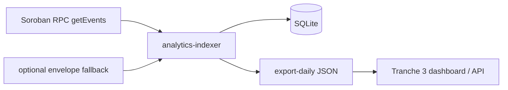

# Analytics Indexer (v0)

On-chain analytics for the LumAgg **aggregator contract** — Tranche 1 Deliverable 4.

## Scope

The indexer polls Soroban RPC **`getEvents`** for the aggregator contract, groups `swap` / `rt` / `leg` topics per `tx_hash`, and stores invocations in SQLite. Daily rollups export as JSON for Tranche 3 dashboard wiring.

**Vault path:** When arb uses `vault.execute_round_trip`, the aggregator still emits events via CPI — same indexer path as direct `round_trip_swap`.

**Legacy fallback:** `INDEXER_ENVELOPE_FALLBACK=1` (default with `INDEXER_MODE=events`) also ingests pre-upgrade txs from `getTransactions` + envelope XDR.

**Not in v0:** public dashboard UI, USD notional conversion.

## Aggregator events (requires WASM upgrade)

After upgrading mainnet aggregator WASM, each successful invoke emits:

| Topic | When | Data fields |
|-------|------|-------------|
| `swap` | `swap()` completes | user, token_in, token_out, amount_in, amount_out, route_count |
| `rt` | `round_trip_swap()` completes | user, base, bridge, amount_in, amount_out, leg_count |
| `leg` | each DEX hop | leg_index, dex_tag, pool, amount_in |

`dex_tag`: 0=aquarius, 1=soroswap, 2=phoenix, 3=sushi, 4=comet

Upgrade: `./contracts/aggregator/upgrade.sh` (see repo README).

## Architecture



1. **Ingest loop** — advance ledger cursor in batches (≤10k ledgers per RPC call).
2. **Parse events** — decode topic + value XDR; group legs by `tx_hash`.
3. **Store** — `swap_invocations` + `swap_legs`; idempotent on `tx_hash`.
4. **Export** — aggregate by UTC day.

## Volume attribution spec

| Field | Source | Notes |
|-------|--------|-------|
| **Function** | topic `swap` → `swap`; topic `rt` → `round_trip_swap` | |
| **User** | summary event field 0 | G-address or contract |
| **Amount in** | summary event | stroops |
| **Split swap** | `route_count > 1` on swap events | |
| **DEX attribution** | `leg` events | per hop |
| **Pool** | `leg` event pool address | |
| **Status** | `inSuccessfulContractCall` | default SUCCESS |

## Configuration

| Variable | Default | Description |
|----------|---------|-------------|
| `INDEXER_MODE` | `events` | `events` \| `envelope` \| `both` |
| `INDEXER_ENVELOPE_FALLBACK` | `true` when mode=events | Also index legacy envelope invokes |
| `INDEXER_RPC_URL` / `SOROBAN_RPC_URL` | mainnet gateway.fm | Soroban RPC endpoint |
| `AGGREGATOR_CONTRACT` | mainnet LumAgg aggregator | Event source contract |
| `INDEXER_DB_PATH` | `./data/analytics-indexer.db` | SQLite file |
| `INDEXER_POLL_SECS` | `30` | Poll interval |
| `INDEXER_START_LEDGER` | — | Initial ledger (else latest − 17,280) |
| `INDEXER_PAGE_LIMIT` | `10000` | getEvents page size |

## Commands

```bash
# Continuous ingest (production)
cargo run -p analytics-indexer -- run

# One-shot backfill from ledger
INDEXER_START_LEDGER=63200000 cargo run -p analytics-indexer -- backfill

# Status
cargo run -p analytics-indexer -- status

# Daily JSON export
cargo run -p analytics-indexer -- export-daily
cargo run -p analytics-indexer -- export-daily 2026-06-01
```

## Tranche 3 handoff

- SQLite schema stable for dashboard reads.
- `export-daily` maps to planned dashboard cards.
- **`GET /api/v1/stats`** on api-server when `INDEXER_DB_PATH` is set (same DB file).
- Public UI: https://lumagg.xyz/stats
- Sample export: [sample-indexer-export.json](./sample-indexer-export.json)

```bash
# api-server env (alongside indexer)
INDEXER_DB_PATH=/opt/stellar-dex-aggregator/data/analytics-indexer.db
curl -s https://api.lumagg.xyz/api/v1/stats | jq .
```

## Development

```bash
cargo test -p analytics-indexer
cargo test -p aggregator-contract   # event emission in contract tests
```

Crate layout: `crates/analytics-indexer/` · RPC: `crates/dex-adapters/src/rpc/events.rs`
